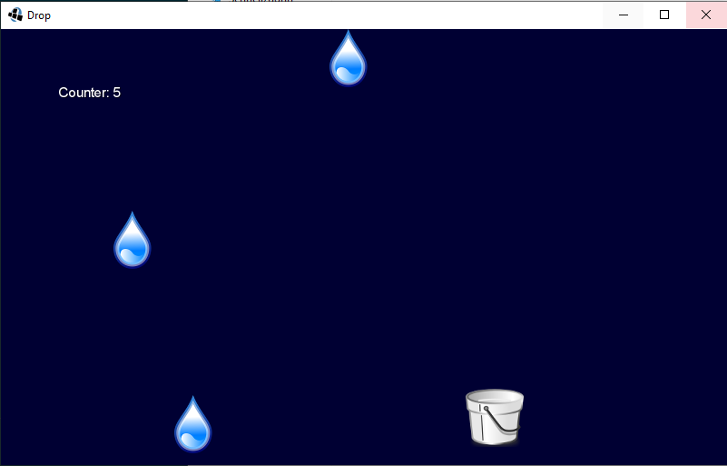

# Fill the bucket

This is a simple game where I tested the libGDX-framework for java. I decided to look for a java-based solution for programming small games as I try to get more into java.

You can control a bucket and collect raindrops that are counted in the upper left corner.

I learned to set up a screen, draw objects to it and implement simple player controls. I also added a very simple MainScreen.

To this point there are no winning or losing conditions. So it is an endless endeavour to collect the drops.

I created a [JAR](FirstLibGDXGame.jar) for you to give it a try. Just jump to it and download it to your computer.
